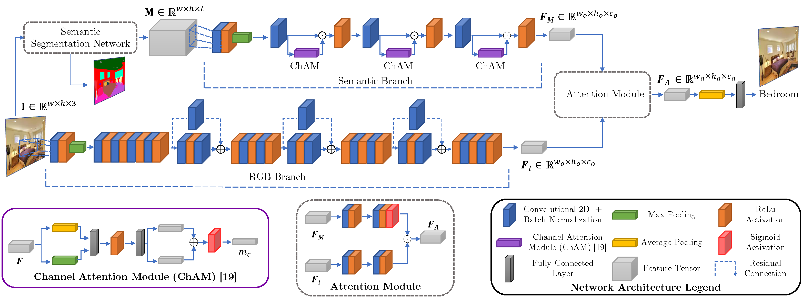

# Semantic Aware-Scene-Recognition
Official Pytorch Implementation of [Semantic-Aware Scene Recognition](https://arxiv.org/abs/1909.02410) by Alejandro López-Cifuentes, Marcos Escudero-Viñolo, Jesús Bescós and Álvaro García-Martín.


## Summary
This paper propose to improve scene recognition by using object information to focalize learning during the training process. The main contributions of the paper are threefold: 

 - We propose an end-to-end multi-modal deep learning architecture which gathers both image and context information using a two-branched CNN architecture.
 - We propose to use semantic segmentation as an additional information source to automatically create, through a convolutional neural network, an attention model to reinforce the learning of relevant contextual information.
 - We validate the effectiveness of the proposed method through experimental results on public scene recognition datasets such as ADE20K, MIT Indoor 67, SUN 397 and Places365 obtaining state-of-the-art results.

The propose CNN architecture is as follows:


## Results
### ADE20K Dataset
| RGB  | Semantic | Top@1 | Top@2 | Top@5 | MCA |
|:--:|:--:|:--:|:--:|:--:|:--:|
| &#10003; |   | 55.90 | 67.25 | 78.00 | 20.96 |
|   | &#10003; | 50.60 | 60.45| 72.10 | 12.17 |
| **&#10003;** | **&#10003;** | **62.55** | **73.25** | **82.75** | **27.00** |

### MIT Indoor  67 Dataset
| Method | Backbone| Number of Parameters | Top@1 |
|--|:--:|:--:|:--:|
| PlaceNet | Places-CNN | 62 M | 68.24 |
| MOP-CNN | CaffeNet | 62 M | 68.90 |
| CNNaug-SVM | OverFeat | 145 M | 69.00 |
| HybridNet | Places-CNN | 62 M | 70.80 |
| URDL + CNNaug | AlexNet | 62 M | 71.90 |
| MPP-FCR2 | AlexNet | 62 M | 75.67 |
| DSFL + CNN (7 Scales) | AlexNet | 62M | 76.23 |
| MPP + DSFL | AlexNet | 62 M | 80.78 |
| CFV | VGG-19 | 62 M | 81.00 |
| CS | VGG-19 | 62 M | 82.24 |
| SDO (1 Scale) | 2 x VGG-19 | 62 M | 83.98 |
| VSAD | 2 x VGG-19 | 62 M | 86.20 |
| SDO (9 Scales) | 2 x VGG-19 | 62 M | 86.76 |
| Ours | ResNet-18 + Sem Branch + G-RGB-H | 47 M | 85.58 |
| **Ours*** | **ResNet-50 + Sem Branch + G-RGB-H** | **85 M** | **87.10** |

### SUN 397 Dataset
| Method | Backbone| Number of Parameters | Top@1 |
|--|:--:|:--:|:--:|
| Decaf | AlexNet | 62 M | 40.94 |
| MOP-CNN | CaffeNet | 62 M | 51.98 |
| HybridNet | Places-CNN | 62 M | 53.86 |
| Places-CNN | Places-CNN | 62 M | 54.23 |
| Places-CNN ft | Places-CNN | 62 M | 56.20 |
| CS | VGG-19 | 143 M | 64.53 |
| SDO (1 Scale) | 2 x VGG-19 | 276 M | 66.98 |
| VSAD | 2 x VGG-19 | 276 M | 73.00 |
| SDO (9 Scale) | 2 x VGG-19 | 276 M | 73.41 |
| Ours | ResNet-18 + Sem Branch + G-RGB-H | 47 M | 71.25 |
| **Ours*** | **ResNet-50 + Sem Branch + G-RGB-H** | **85 M** | **74.04** |

### Places 365 Dataset
| Network | Number of Parameters | Top@1 | Top@2 | Top@5 | MCA |
|--|:--:|:--:|:--:|:--:|:--:|
| AlexNet | 62 M | 47.45 | 62.33 | 78.39 | 49.15 |
| AlexNet* | 62 M | 53.17 | - | 82.59 | - |
| GooLeNet* | 7 M | 53.63 | - | 83.88 | - |
| ResNet-18 | 12 M | 53.05 | 68.87 | 83.86 | 54.40 |
| ResNet-50 | 25 M | 55.47 | 70.40 | 85.36 | 55.47 |
| ResNet-50* | 25 M | 54.74 | - | 85.08 | - |
| VGG-19* | 143 M | 55.24 | - | 84.91 | - |
| DenseNet-161 | 29 M | 56.12 | 71.48 | 86.12 | 56.12 |
| **Ours** | **47 M** | **56.51** | **71.57** | **86.00** | **56.51** |

## Setup
### Requirements
The repository has been tested in the following software versions.
 - Ubuntu 16.04
 - Python 3.6
 - Anaconda 4.6
 
### Clone Repository
Clone repository running the following command:

	$ git clone https://github.com/vpulab/Semantic-Aware-Scene-Recognition.git

### Anaconda Enviroment
To create and setup the Anaconda Envirmorent run the following terminal command from the repository folder:

    $ conda env create -f Config/Conda_Env.yml
    $ conda activate SA-Scene-Recognition

### Datasets
Download and setup instructions for each datasets are provided in the follwing links:

 - [ADE20K](https://github.com/alexlopezcifuentes/Semantic-Aware-Scene-Recognition/tree/master/Data/Datasets/ADEChallengeData2016)
 - [MIT Indoor 67](https://github.com/alexlopezcifuentes/Semantic-Aware-Scene-Recognition/tree/master/Data/Datasets/MITIndoor67)
 -  [SUN 397](https://github.com/alexlopezcifuentes/Semantic-Aware-Scene-Recognition/tree/master/Data/Datasets/SUN397)
 -  [Places 365](https://github.com/alexlopezcifuentes/Semantic-Aware-Scene-Recognition/tree/master/Data/Datasets/places365_standard)


## Evaluation

### Model Zoo
In order to evaluate the models independently, download them from the following links and indicate the path in YAML configuration files (Usually `/Data/Model Zoo/DATASET FOLDER`).

[**Recommended**] Alternatively you can run the following script from the repository folder to download all the available Model Zoo:

    bash ./Scripts/download_ModelZoo.sh

**ADE20K**
 - [Ours](https://dauam-my.sharepoint.com/:u:/g/personal/alejandro_lopezc01_estudiante_uam_es/EdjBkchzYmxMtemweugTNp8BAK_kzUmHwvFbmXgsE_VKRQ?download=1)
 - [RGB Branch](https://dauam-my.sharepoint.com/:u:/g/personal/alejandro_lopezc01_estudiante_uam_es/EY-boXwjIhZMq0LkaIqng48BY-ezHhF4t-0ctwOmSUYAjw?download=1)
 - [Semantic Branch](https://dauam-my.sharepoint.com/:u:/g/personal/alejandro_lopezc01_estudiante_uam_es/EYJ593CJEylMkRoyAO_UCWUBGKbUJIpGO_1VzeHeQYvBEA?download=1)

**MIT Indoor 67**
 - [Ours](https://dauam-my.sharepoint.com/:u:/g/personal/alejandro_lopezc01_estudiante_uam_es/EY5d6PU_Jo9ElazZpYvGn5cBI6aZChWQiyC3pXzey6L3cA?download=1)
 - [RGB Branch](https://dauam-my.sharepoint.com/:u:/g/personal/alejandro_lopezc01_estudiante_uam_es/EQfMFvxYdIFPmY6jJ4OPCssB8axLM9KyW7JWGIoOVkF0oQ?download=1)
 - [Semantic Branch](https://dauam-my.sharepoint.com/:u:/g/personal/alejandro_lopezc01_estudiante_uam_es/ETRa2iuWq-BKqyEKTnSY_VkBzsO2FbSZvTyav5fi5iDpug?download=1)

**SUN 397**
 - [Ours](https://dauam-my.sharepoint.com/:u:/g/personal/alejandro_lopezc01_estudiante_uam_es/EcNjUGAgE1dCss00_6A05_oBMjSUviEYigm0F_QcmW914g?download=1)
 - [RGB Branch](https://dauam-my.sharepoint.com/:u:/g/personal/alejandro_lopezc01_estudiante_uam_es/ERFBOWinVolPuYkAjdipF00BHxeQ9mjzlO5Oc_x3NLzDdw?download=1)
 - [Semantic Branch](https://dauam-my.sharepoint.com/:u:/g/personal/alejandro_lopezc01_estudiante_uam_es/EQxpscYkhY5Nh55sdSgaINkBcqSMZ9b32K8AbrDfUKO2_w?download=1)

**Places 365**
 - [Ours](https://dauam-my.sharepoint.com/:u:/g/personal/alejandro_lopezc01_estudiante_uam_es/Eco7I0NbpWFFpJdYjT1om38BX2aEBR1WXXzflE2YykT0qA?download=1)
 - [RGB Branch](https://dauam-my.sharepoint.com/:u:/g/personal/alejandro_lopezc01_estudiante_uam_es/EUaPpF5MpkNCqDd04GMVnYEB6BnH5inElN9ve_trAiWg-A?download=1)
 - [Semantic Branch](https://dauam-my.sharepoint.com/:u:/g/personal/alejandro_lopezc01_estudiante_uam_es/Ea_B3l8vdRtJg3fjhwm7KeIBCbDGV5L2MOtpo9E5GGBo3Q?download=1)
	
### Run Evaluation
In order to evaluate models run `evaluation.py` file from the respository folder indicating the dataset YAML configuration path:

    python evaluation.py --ConfigPath [PATH to configuration file]
    
Example for ADE20K Dataset:

    python evaluation.py --ConfigPath Config/config_ADE20K.yaml
    
Computed performance metrics for both training and validation sets are:
 - Top@1
 - Top@2
 - Top@5
 - Mean Class Accuracy (MCA)


## Citation
If you find this work useful, please consider citing:
```
@inproceedings{XX,
  title={XXXX},
  author={XXX},
  booktitle={XXX},
  year={XXX}
}
```
## Acknowledgment
This study has been partially supported by the Spanish Government through its TEC2017-88169-R MobiNetVideo project.

